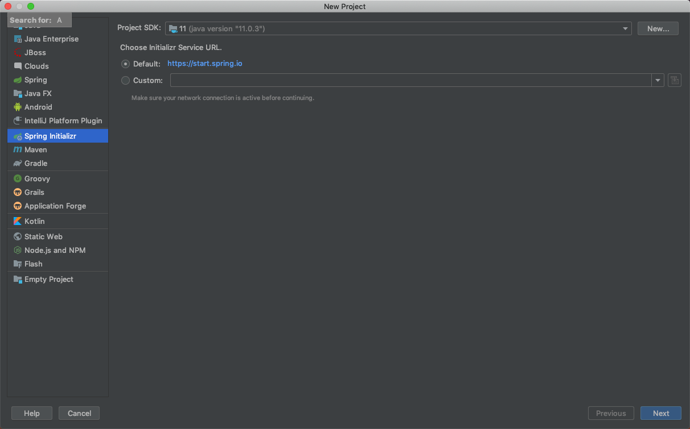
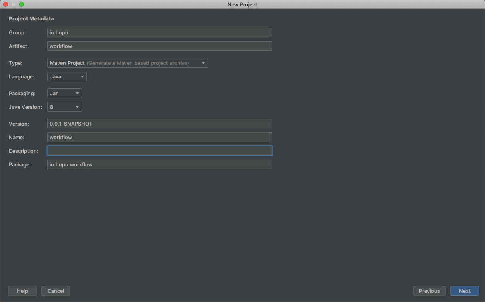
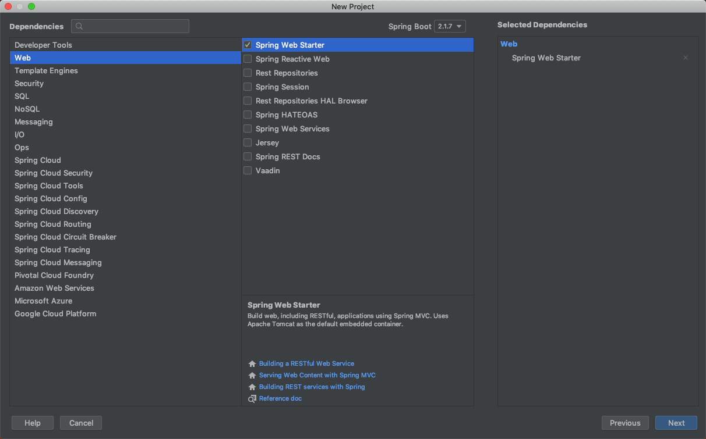
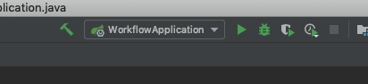
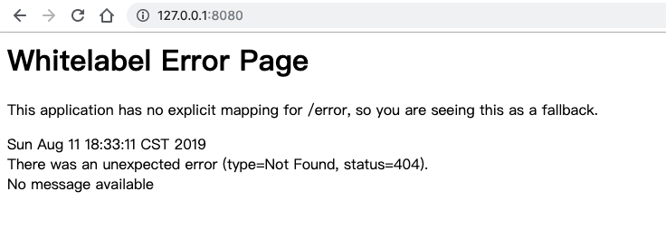
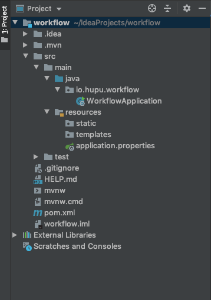

## 从 Hello World开始
1. 从 IDEA 创建 Spring Boot项目
	

2. 填写项目基本信息
	

3. 选择项目组件（这里暂时仅勾选Spring Boot Starter）
	

4. 之后IDEA将下载Spring Boot所需要的项目代码

5. 代码下载完毕后即可启动运行。
	

	打开浏览器 [http://127.0.0.1:8080](http://127.0.0.1:8080) 即可看到首页
	
	别担心，因为我们还没有定义项目的首页路由，所以是一个错误页面。

6. 项目结构分析
	
	* `src` 项目中代码存放目录
	* `src/main` Java代码存放目录
	* `src/resources` 静态文件、配置文件存放目录
	* `src/resources/application.properties` 配置文件
	* `pom.xml` 软件包管理配置文件(maven)， 类似于PHP的composer

7. 编写一个 hello world
    在 `src/main/java/{your project package}/controller` 下新建一个 `IndexController.java` 文件
    ``` java
    package io.hupu.workflow.controller;

    import org.springframework.web.bind.annotation.GetMapping;
    import org.springframework.web.bind.annotation.RestController;

    /**
     * 其中@开头的被成为注解，Spring 在启动的时候会扫描项目中的注解，并实现相应注解的功能
     * @RestController 表示这个 Controller 是一个 restful 风格的 Controller
     */
    @RestController
    public class IndexController {

        /**
         * @GetMaping 定义此方法是一个 GET 方式，uri 为 / 的方法
         * @return String
         */
        @GetMapping(value = "/")
        public String index() {
            return "hello world";
        }
    }

    ```
    重新启动项目，访问首页你将看到 `hello world`。


